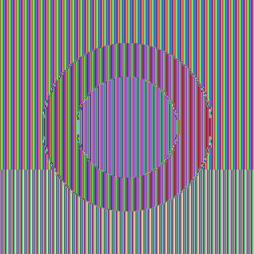
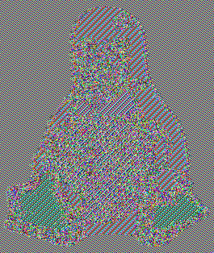
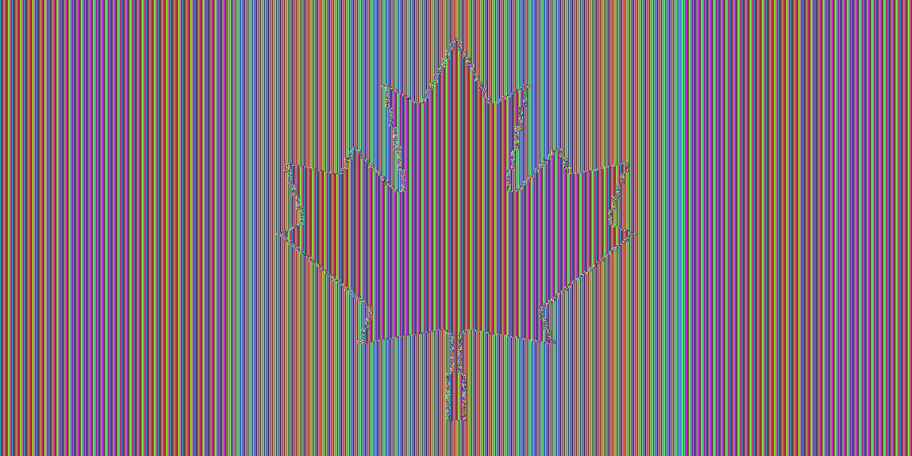
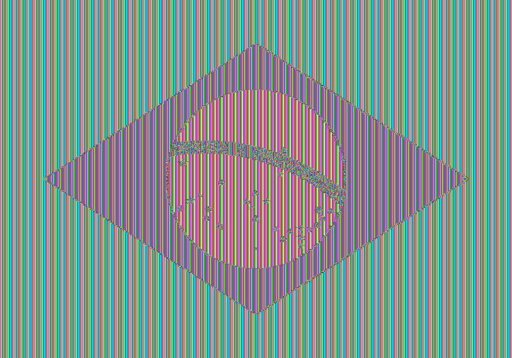

# Why ECB is Bad

A visual demonstration of why **ECB (Electronic Codebook)** mode is an insecure way to use a block cipher, implemented in Rust.

## The Problem

AES is a block cipher — it encrypts exactly 16 bytes at a time. When you need to encrypt more data, you need a **mode of operation** that defines how to apply AES repeatedly.

**ECB** is the naive approach: split the data into 16-byte blocks and encrypt each one independently with the same key.

```
plaintext:   [block_0] [block_1] [block_2] [block_3]
                ↓          ↓          ↓          ↓
             AES(key) AES(key)   AES(key)   AES(key)
                ↓          ↓          ↓          ↓
ciphertext:  [enc_0]  [enc_1]   [enc_2]   [enc_3]
```

The fatal flaw: **identical plaintext blocks always produce identical ciphertext blocks**. When applied to images with large uniform-color regions, the structure of the original image survives encryption — the shapes are still visible.

**CBC (Cipher Block Chaining)** fixes this by XORing each block with the previous ciphertext block before encrypting, so identical inputs produce different outputs depending on their position.

## Results

### Synthetic image

| Original | ECB | CBC |
|----------|-----|-----|
|  |  |  |

### Tux (Linux mascot)

| Original | ECB | CBC |
|----------|-----|-----|
|  |  |  |

### Canadian flag

| Original | ECB | CBC |
|----------|-----|-----|
|  |  |  |

### Brazilian flag

| Original | ECB | CBC |
|----------|-----|-----|
|  |  |  |

## Running it yourself

### Prerequisites

Install Rust via [rustup](https://rustup.rs):

```bash
curl --proto '=https' --tlsv1.2 -sSf https://sh.rustup.rs | sh
```

### Run

```bash
git clone https://github.com/jicanta/why-ecb-is-bad
cd why-ecb-is-bad
cargo run
```

This generates all input and encrypted images under `assets/`.

## Note on hardcoded key and IV

The AES key (`mysecretkey12345`) and CBC initialization vector (`randomiv12345678`) are hardcoded constants. This is intentional — the goal is to visualize the structural weakness of ECB mode, not to build production-grade encryption. In real software you would never hardcode a key, and the IV should be randomly generated per encryption and transmitted alongside the ciphertext.

## Project structure

```
src/
  main.rs        — entry point, defines demo list, orchestrates processing
  encryption.rs  — encrypt_ecb and encrypt_cbc implementations
  images.rs      — synthetic image generator and image reconstruction helper
assets/
  *.png          — original and encrypted output images
```
